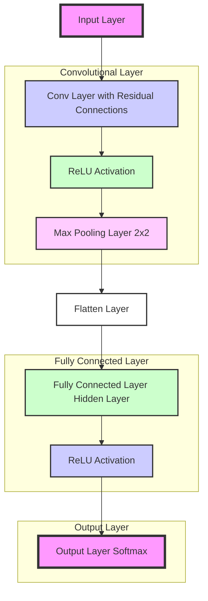

# tinyMNIST Visualization and Training

This project provides a JavaScript-based implementation for visualizing and training a Convolutional Neural Network (CNN). It includes functionalities for visualizing input images, feature maps, network activations, training progress, and predictions.



## Features

- **Digit Visualization**: Display input images as grayscale images.
- **Loss Visualization**: Plot training loss over epochs.
- **Softmax Predictions**: Display the softmax output as a bar chart.
- **Network Visualization**: Visualize network layers, nodes, and connections.
- **Feature Maps Visualization**: Display the feature maps produced by the convolutional layer.
- **Training and Prediction**: Train the CNN on MNIST data and make predictions.


## Usage

### Training the Network

To train the CNN, call the `trainNetwork` function with the number of epochs. The function will fetch MNIST data, train the network, and update the visualizations.

```javascript
trainNetwork(epochs);
```

## Example

Here’s how you can set up and run the training:

```javascript
const cnn = new ConvNet(Data.model_params.input_dim, Data.model_params.kernel_dim, Data.model_params.num_kernels, Data.model_params.hidden_nodes, Data.model_params.output_nodes);

async function runTraining() {
    await trainNetwork(1);
}

runTraining();
```

# ConvNet.js

**ConvNet.js** is a simple implementation of a Convolutional Neural Network (CNN) in JavaScript. This library provides a basic structure for building, training, and evaluating convolutional neural networks, suitable for educational purposes and small-scale projects.

## Features

- **Convolutional Layer with Residual Connections**: Applies convolution with residual connections to improve gradient flow.
- **Max Pooling**: Reduces dimensionality and retains the most important features.
- **Fully Connected Layers**: Connects the flattened pooled output to hidden and output layers.
- **Activation Functions**: Uses sigmoid, ReLU, and softmax activation functions.
- **Adam Optimizer**: Implements the Adam optimization algorithm for training.

## Installation

To use ConvNet.js, simply include the JavaScript file in your project. You can either copy the code into your project or save it as `ConvNet.js` and include it in your HTML:

```html
<script src="ConvNet.js"></script>
```

## Usage

### Creating a ConvNet Instance

```javascript
const input_dim = 28; // Input dimensions (e.g., 28x28 for MNIST images)
const kernel_dim = 3; // Kernel dimensions (e.g., 3x3)
const num_kernels = 8; // Number of kernels (filters)
const hidden_nodes = 64; // Number of hidden nodes
const output_nodes = 10; // Number of output nodes (e.g., 10 for MNIST classes)

const cnn = new ConvNet(input_dim, kernel_dim, num_kernels, hidden_nodes, output_nodes);
```

### Prediction

To get predictions for an input array:

```javascript
const input_array = [/* input data here */];
const probabilities = cnn.predict(input_array);
console.log(probabilities); // Array of probabilities for each class
```

### Get Activations

To retrieve intermediate activations:

```javascript
const activations = cnn.getActivations(input_array);
console.log(activations);
```

### Get Weights and Biases

To get the current weights and biases:

```javascript
const weightsBiases = cnn.getWeightsAndBiases();
console.log(weightsBiases);
```

### Get Feature Maps

To get the feature maps produced by the convolutional layer:

```javascript
const featureMaps = cnn.getFeatureMaps(input_array);
console.log(featureMaps);
```

### Training

To train the network with input and target arrays:

```javascript
const input_array = [/* input data here */];
const target_array = [/* target labels here */];
const loss = cnn.train(input_array, target_array);
console.log('Loss:', loss);
```

## API

### Constructor

```javascript
new ConvNet(input_dim, kernel_dim, num_kernels, hidden_nodes, output_nodes)
```

- `input_dim`: Dimension of the input (assumes square input, e.g., 28 for 28x28 images).
- `kernel_dim`: Dimension of the kernel (assumes square kernels, e.g., 3 for 3x3 kernels).
- `num_kernels`: Number of convolutional kernels.
- `hidden_nodes`: Number of hidden nodes in the fully connected layer.
- `output_nodes`: Number of output nodes (classes).

### Methods

- `predict(input_array)`: Returns the probabilities for each class.
- `getActivations(input_array)`: Returns intermediate activations.
- `getWeightsAndBiases()`: Returns current weights and biases.
- `getFeatureMaps(input_array)`: Returns the feature maps from the convolutional layer.
- `train(input_array, target_array)`: Trains the network and returns the loss.

## Optimization Parameters

- **Learning Rate**: Adjusted through `this.learning_rate`.
- **Gradient Clipping**: Set through `this.gradient_clip`.
- **Adam Optimizer Parameters**:
  - `beta1`
  - `beta2`
  - `epsilon`

## Example

```javascript
const cnn = new ConvNet(28, 3, 8, 64, 10);

const input_array = [/* 28x28 image data here */];
const target_array = [/* One-hot encoded target here */];

const loss = cnn.train(input_array, target_array);
console.log('Training Loss:', loss);

const probabilities = cnn.predict(input_array);
console.log('Predicted Probabilities:', probabilities);
```


